# Artistic Neural Style Transfer

This repository contains my PyTorch implementation of the Neural Style Transfer algorithm, originally proposed by Leon A. Gatys, Alexander S. Ecker, and Matthias Bethge in their paper [*A Neural Algorithm of Artistic Style*](https://arxiv.org/abs/1508.06576). The algorithm leverages the feature representations of a pretrained VGG-19 network to separate and recombine the content and style of arbitrary images.

For a deeper understanding of the paper and its implementation details, I’ve also documented my notes here: [Notion Notes](https://www.notion.so/A-Neural-Algorithm-of-Artistic-Style-2fc7cb484d7580ca8562c0cf3d7f5d59?source=copy_link)

---

## Project Structure

The project is structured into modular components for clarity and ease of use:

- **`artistic_neural_net.py`**: The main entry point for the project. This script handles image preparation, model initialization, optimization using `LBFGS`, and TensorBoard logging. It includes arg-parsing for easy execution via the command line.
- **`losses/`**: Contains the implementations of the respective loss functions used to optimize the generated image:
  - **`content.py`**: Computes the mean-squared error between the generated image and the content image feature representations.
  - **`style.py`**: Extracts the Gram matrices of the feature representations and computes the mean-squared error to capture texture and stylistic information.
  - **`tv_loss.py`**: Total Variation Loss, used as a regularization term to encourage spatial smoothness in the generated image, reducing noise and artifacts.
- **`models/`**: Manages the VGG-19 model architecture.
  - **`feature_extractor.py`**: Extracts intermediate features from specific layers of the VGG network.
  - **`model.py`**: Loads the pretrained VGG-19 model and integrates the feature extraction mechanism.
- **`utils/`**: Helper scripts for image processing operations.
  - **`transforms.py`**: Manages torchvision transforms (resizing, normalization, etc.) applied to images.
  - **`utils.py`**: General utility functions (e.g., converting paths to PIL Images, tensor denormalization).
- **`jupyter notebooks/`**: Contains notebooks used for initial experimentation and visualization (e.g., `nst.ipynb`).

---

## Installation Guide

- Clone the repository:
```bash
git clone https://github.com/LibanAnsari/Neural-Style-Transfer-Pytorch.git
cd Neural-Style-Transfer-Pytorch
```

(Optional) Create a Virtual Environment

Linux / macOS:
```bash
python -m venv .venv
source .venv/bin/activate
```

Windows:
```bash
python -m venv .venv
.venv\Scripts\activate
```

- Install dependencies:
```bash
pip install -r requirements.txt
```

GPU Support (Recommended):
If you have an NVIDIA GPU, install PyTorch with CUDA support from:
https://pytorch.org/get-started/locally/
This will significantly speed up style transfer.

---

## Usage

You can run the style transfer process using the `artistic_neural_net.py` script. The script uses the `LBFGS` optimizer to iteratively refine a noisy version of the content image. It logs the generated images and loss curves to TensorBoard.

```bash
python artistic_neural_net.py `
    --content-path "path/to/content/image.jpg" `
    --style-path "path/to/content/image.jpg" `
    --save-path "path/to/outputs/dir" `
    --output-name "my_generated_art" `
    --img-size 512 `
    --epochs 25 `
    --alpha 1.0 `
    --beta 1000.0 `
    --content-layer conv4_1 `
    --style-layers conv1_1 conv2_1 conv3_1 conv4_1 conv5_1 `
    --wl 0.2
```

### Arguments:
- `--h --help`: Shows help message and exit.
- `--content-path`: Path to the content image (required).
- `--style-path`: Path to the style image (required).
- `--save-path`: Output directory (default: `/outputs`).
- `--output-name`: Output file name (default: `generated_art.jpg`).
- `--img-size`: Image resolution (default: `512`).
- `--epochs`: Number of iterations (default: `25`, note: LBFGS runs multiple internal steps).
- `--alpha`: Content loss weight (default: `1.0`).
- `--beta`: Style loss weight (default: `1000.0`).
- `--content-layer`: Content loss layer (default: `conv4_1`).
- `--style-layers`: Style loss layers (default: `conv1_1 conv2_1 conv3_1 conv4_1 conv5_1`).
- `--wl`: Weight per style layer (default: `1 / number of style layers`).

Since, many of the parameters are said to default values as per mentioned in the original paper, you can get started with just the required arguments only.

**Minimal Command (only required)**
```bash
python artistic_neural_net.py `
    --content-path "path/to/content/image.jpg" `
    --style-path "path/to/content/image.jpg"
```
Note: You can ignore tensorflow warnings if they occur.

---

## Results Comparison

The following results illustrate how a single content image can be transformed using various artistic styles. All outputs are generated using the default parameters specified in the arguments section, that includes `25 iterations` with `alpha = 1` and `beta = 1e3`.

### Content Image
<div align="center">
    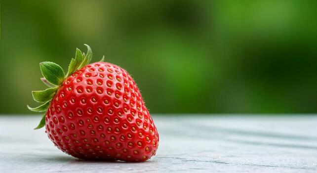
</div>

### Style Transfer Results

| Style Image | Generated Output |
| :---: | :---: |
| 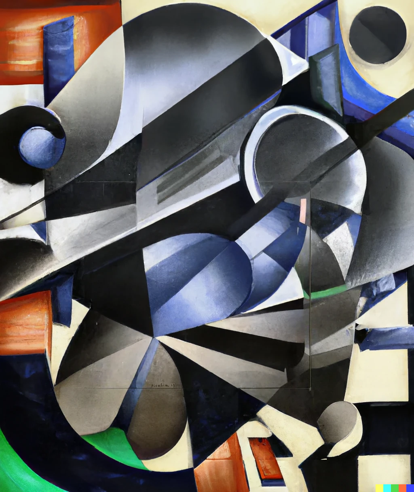 | 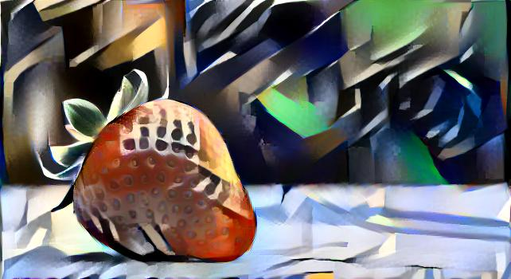 |
| 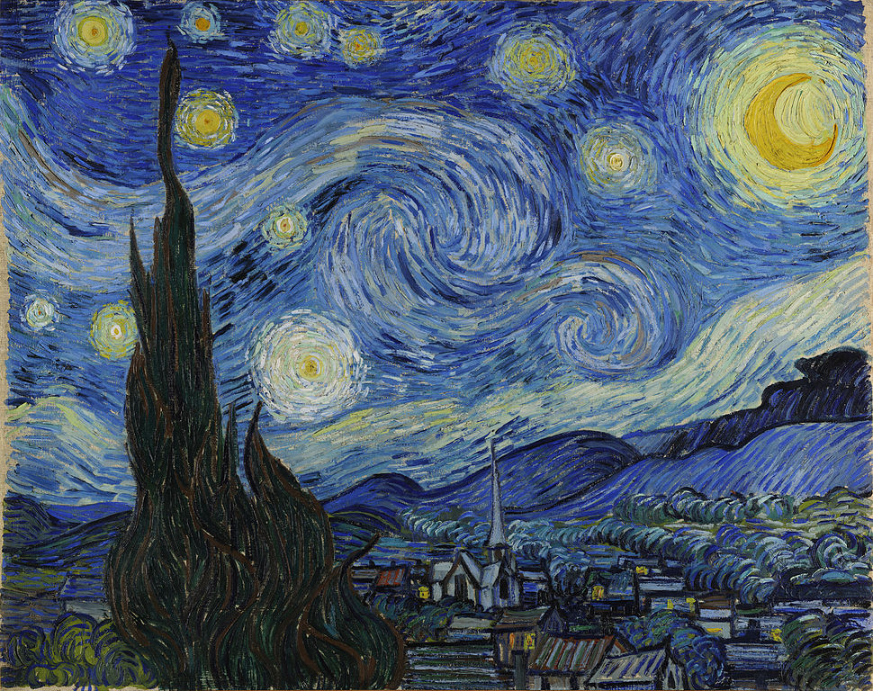 | 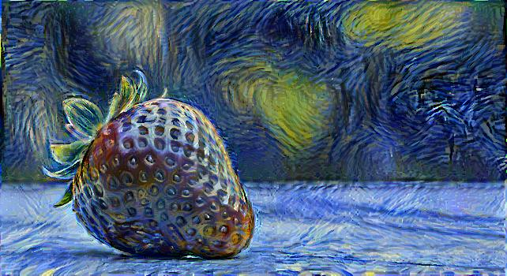 |
| 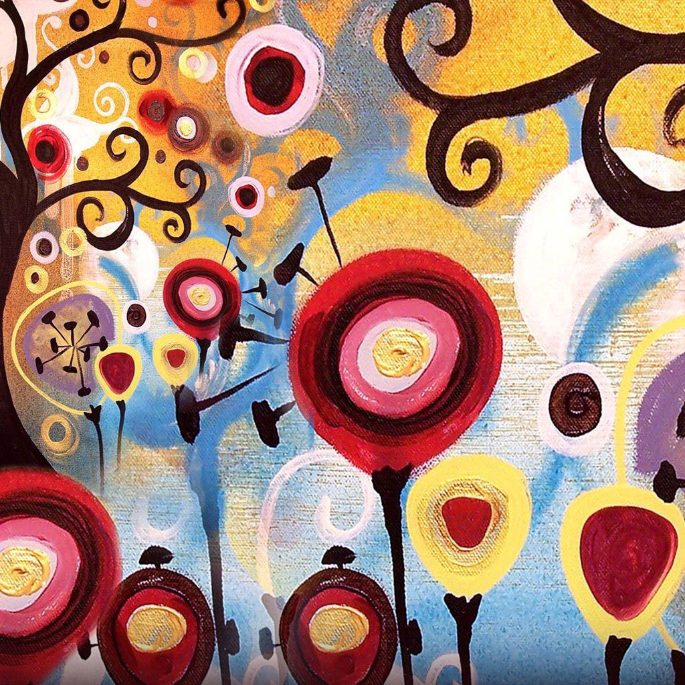 | 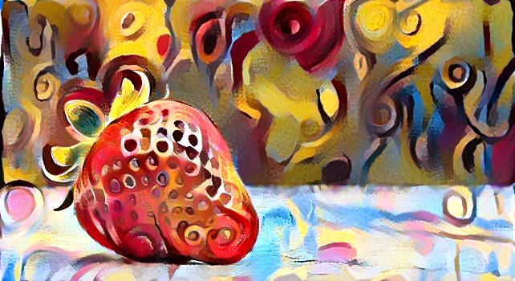 |
| 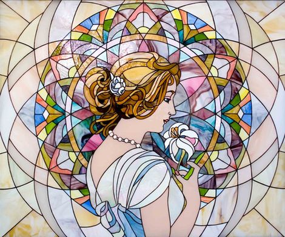 | 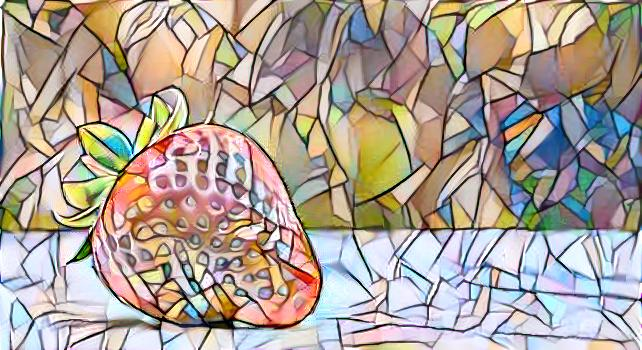 |
| 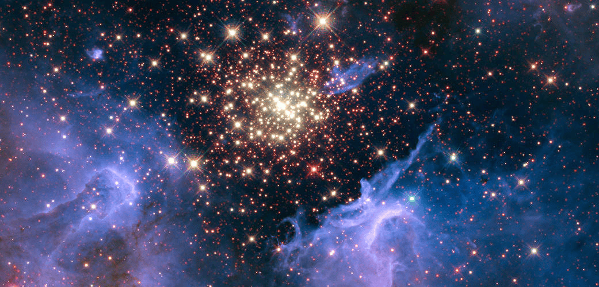 | 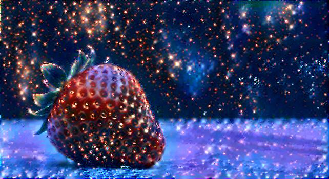 |

---

## Control & Trade-offs

The final stylized output can be controlled using:

- **Style weight (`beta`)**
- **Content weight (`alpha`)**
- **Total Variation (TV) regularization** for smoother results

In practice, it is effective to keep the content weight fixed (e.g., `alpha = 1.0`) and vary the style weight (`beta`). The key factor is the **ratio between style and content weights**, which determines the strength of stylization.

Lower values of the content-to-style ratio (α/β) produce more stylized results, while higher values preserve more of the original content structure.

### Effect of Style Weight

The images below illustrate the effect of increasing the style weight. Each output is generated over **25 iterations** with `alpha = 1.0` and `beta` varying across `1e2`, `1e3`, `1e4`, and `1e5` (from left to right), following the comparison setup used in the original paper.

<div align="center">
    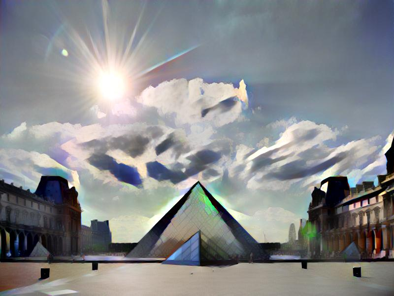
    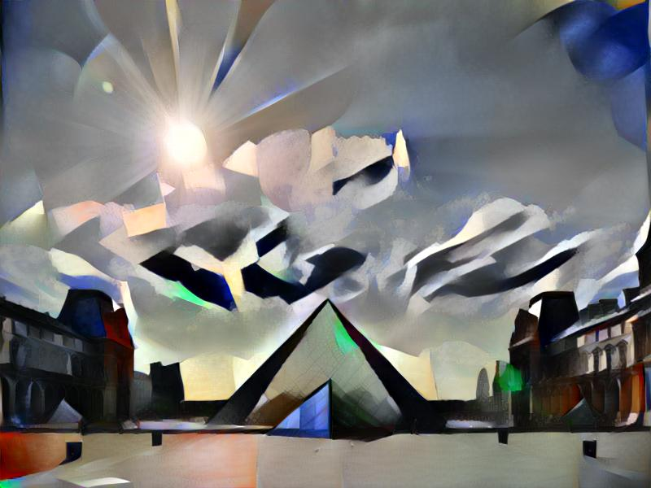
    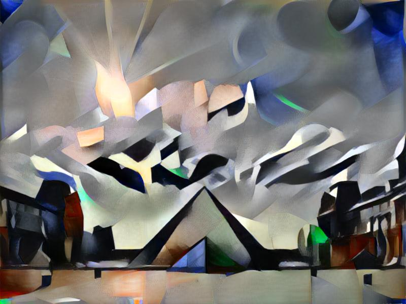
    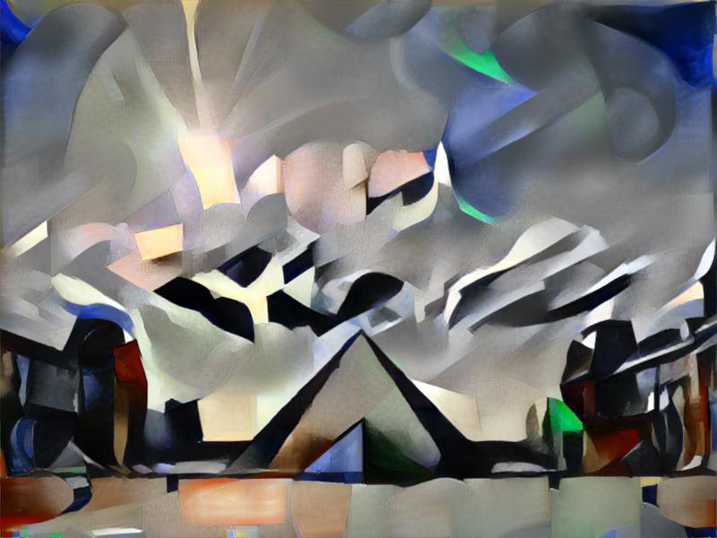
</div>

### Total Variation Regularization

Total Variation (TV) loss helps reduce noise and encourages spatial smoothness in the generated image. 

In this implementation, a small fixed weight of `1e-6` is used, which is sufficient to improve visual quality without over-smoothing the output.

---

## Visualization & TensorBoard
You can monitor the optimization process in real time, including how the generated image evolves and how the content, style, and total variation losses change over iterations.

To launch TensorBoard, run the following command in a separate terminal:
```bash
tensorboard --logdir=runs
```
Then open your browser and go to: http://localhost:6006/

Below is a demonstration of the training process, visualized using TensorBoard over 25 iterations. The GIF highlights how the generated image progressively adopts the characteristics of the style image while retaining the structural layout of the content image. Additionally, you can observe the convergence of the loss curves (Content, Style, and Total Loss) over time.

### Sample Loss Curves
<div align="center">
    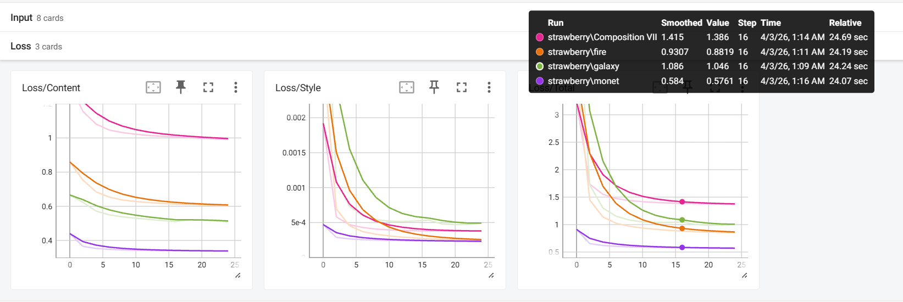
</div>

### Training Process (GIF)
<div align="center">
    
</div>

---
